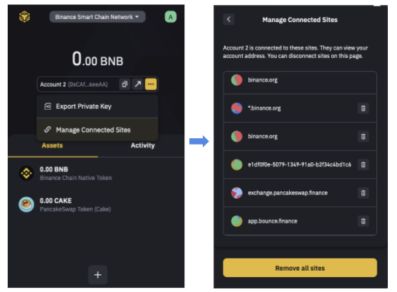

# dApp Integration

There are many dApps supporting Binance Chain wallet: 

* [https://exchange.pancakeswap.finance/](https://exchange.pancakeswap.finance/)
* [http://bsc.bounce.finance/](http://bsc.bounce.finance/)
* [https://app.beefy.finance/](https://app.beefy.finance/)

## Getting Connected

* Choose Binance

* Sign Transactions

### DeFi App Authorized sites management


This feature is introduced in version 1.131.1.



 Please pay attention to all the apps which have access to your account 


dApps need to ask permission to view users’ accounts. Users could see “Login” or “Connect” buttons on Binance Smart Chain dApps. These buttons will prompt a popup from Binance Extension wallet asking if the user wants to grant the site access to their public account information. For example:   

### Revoke Permission

Binance extension will remember which sites have been approved until the user wish to change their list. Once you wish to edit the connected sites list: You need to: 

1. Select the account you’d like to change
2. On the Account page, click on the menu \(three dots\) and lick “Manage Connected Sites” 

