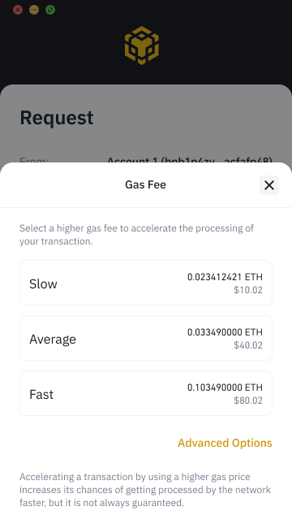
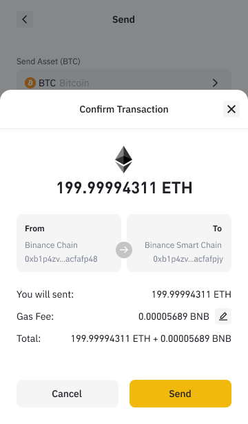

# Ethereum Support


Binance Extension wallet supports Ethereum mainnet since Version 1.131.1.


## Migrate to Binance Extension Wallet

If you already have an account on Ethereum, it can be imported into Binance Extension wallet easily, you only need to:

* Export seed phrase
* [Recover your account](acc/recover.md)

## What you can do

### **Same address for two networks**

You can use Binance Extension wallet to control the same address on different blockchains, namely Ethereum and Binance Smart Chain.

### Wallet Direct 

You can pair your Binance.com account with your Ethereum address now. Read [here](../wallet-direct/introduction.md) for more details. 

### Binance Bridge

If you want to transfer ERC20 to its BEP20 equivalents, you can send them to Binance Bridge from the extension wallet directly. No need to interact with two different wallets. 

### Dapp Integration

You can use Binance Extension wallet to use those popular dApps. 

## Adjust Gas Price and Gas Limit

If you do not know what is [gas](https://academy.binance.com/en/glossary/gas) or [gas limit](https://academy.binance.com/en/glossary/gas-limit), please read the articles from Binance Academy. 

BEW now provides with the option to adjust gas price and gas limit when

On the page of transaction confirmation, click at "pencil" button to edit gas

click Fastest, Fast, or Slow next to Transaction fee:

Then, you need to confirm the transaction fee

Click "Send" to broadcast your transaction

