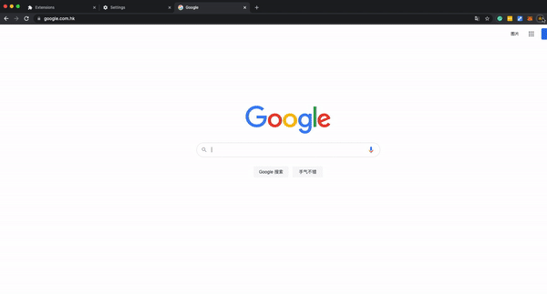

# Connection Issue with Ledger

The latest Google Chrome release ([Chrome 91](https://chromium.googlesource.com/chromium/src/+log/90.0.4430.212..91.0.4472.77?pretty=fuller\&n=10000))  causes U2F transport issues on third-party wallets like MetaMask for Mac and Linux users. Due to this issue, you might experience issues when trying to connect to Binance Wallet Extension.&#x20;

This issue also affects other Chromium browsers (Brave, Microsoft Edge, etc…) on the same version.&#x20;

Considering those changes significantly altering the user experience and the availability of WebUSB as the standard method for interacting with a USB device, we plan to sunset the U2F transport and migrate to WebUSB to natively communicate with Ledger devices. However, we will preserve old logic for Firefox.&#x20;

### Before you start

* Make sure you are using the latest version of Binance Wallet Extension (v2.4.0).&#x20;

## Fix connection issues of Chrome

### Pair Binance Wallet extension with your Ledger hardware wallet

Chrome lets you connect a website to your Bluetooth and USB devices.&#x20;

1. Connect your Ledger.
   * Connect your Ledger Nano s/X using a USB cable.
2. In Chrome, open BEW
3. Click to import wallet from hardware.
4. Choose a device from the list.
5. Choose **Connect**.

Well done! Now you can use Ledger on Chrom again 🎉


If the approval page is not open automatically, you can open it manually with this link:  chrome-extension://fhbohimaelbohpjbbldcngcnapndodjp/popup.html#/en/hardware-wallet/authority


## Remove Ledger devices connected with Chrome

To remove a website's access to your USB devices, follow these steps:

**First, go to **chrome://settings/content/usbDevices?search=device&#x20;

.png>)

Next to the Ledger device, click Remove .

