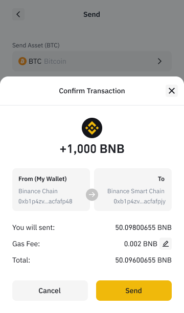

# How to Adjust Gas Price and Gas Limit on Binance Smart Chain

If you do not know what is [gas](https://academy.binance.com/en/glossary/gas) or [gas limit](https://academy.binance.com/en/glossary/gas-limit), please read the articles from Binance Academy. 

BEW now provides with the option to adjust gas price and gas limit for Binance Smart  Chain mainnet and testnet. 

On the page of transaction confirmation, click at "pencil" button to edit gas

Choose gas price and gas limit

Then, you need to confirm the transaction fee

Click "Send" to broadcast your transaction

