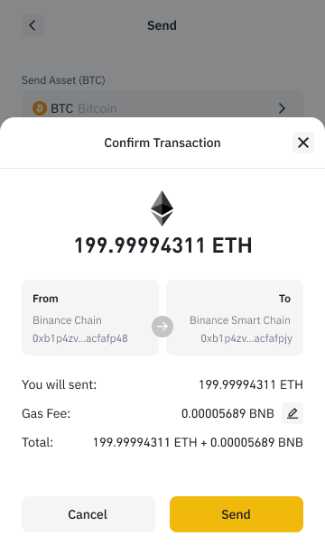

# How to Adjust Gas Price and Gas Limit

If you do not know what is [gas](https://academy.binance.com/en/glossary/gas) or [gas limit](https://academy.binance.com/en/glossary/gas-limit), please read the articles from Binance Academy. 

BEW now provides with the option to adjust gas price and gas limit for Ethereum network

On the page of transaction confirmation, click at "pencil" button to edit gas

click Fastest, Fast, or Slow next to Transaction fee:

Then, you need to confirm the transaction fee

Click "Send" to broadcast your transaction

