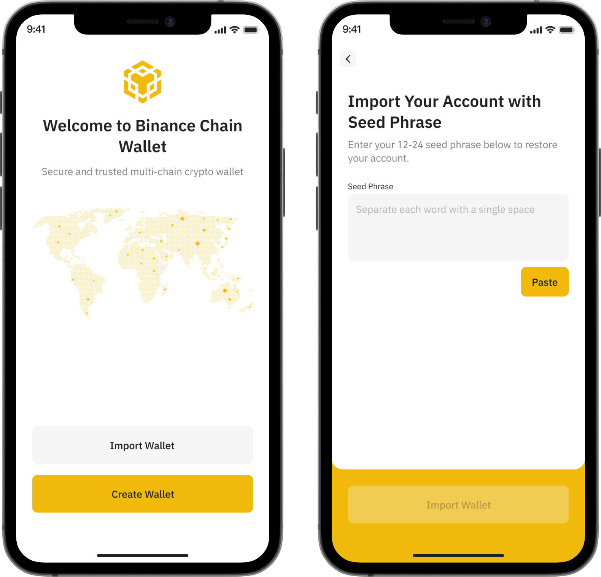
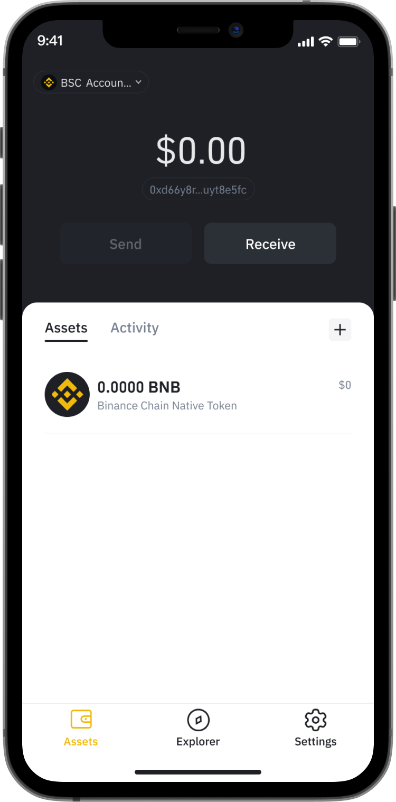
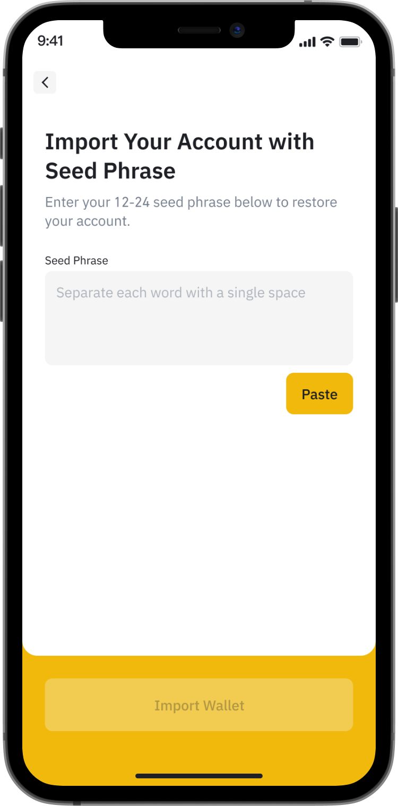

# How to create and restore wallets on BMW

After downloading the app, all you need to do is go to the app and enjoy it!

On the home screen of Binance Wallet, you can create a new wallet or restore the wallets from other apps to use from now on.

### **Creating a new wallet**

After logging in to the app’s home screen, you can create a Multi-chain wallet by following these steps:

* Step 1: Click **Create Wallet** on the home screen.
* Step 2: Write down your seed phrase
* Step 3: Click Continue and verify your **seed phrase**.

Your new wallet will instantly be displayed on the home screen.&#x20;

Note: Seed phrases are crucial to your assets. Store this information carefully.

### **Restoring your wallet**

Already had a wallet before? You can easily restore it in simple steps:

Step 1: Click **Import Wallet** on home screen.

Step 2: Input your seed phrase, then click Import Wallet.\

**Well done! Now you are ready to go!** \
