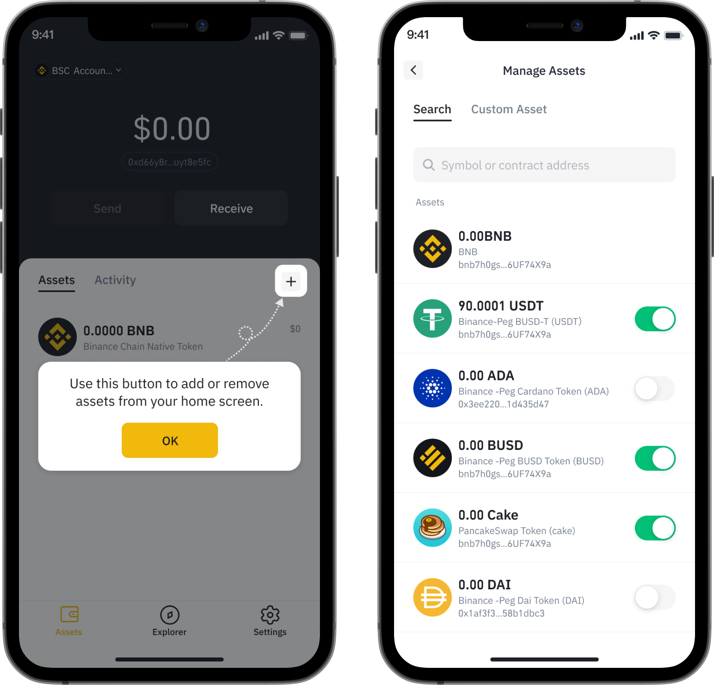
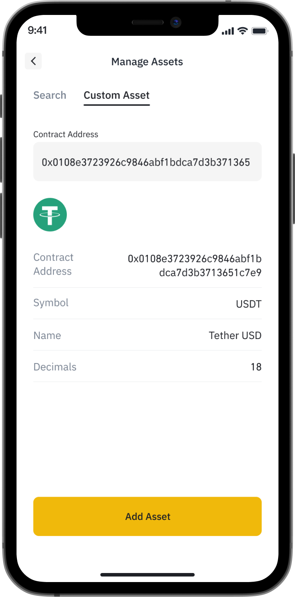

# How to manage your asset list on Binance Wallet

By default, only BNB is displayed. To add more assets:

Step 1: You can click “**+**” to Manage your wallets.

Step 2: Search asset by token symbol

If you wish to add custom assets, you can add them manually with contract address:

