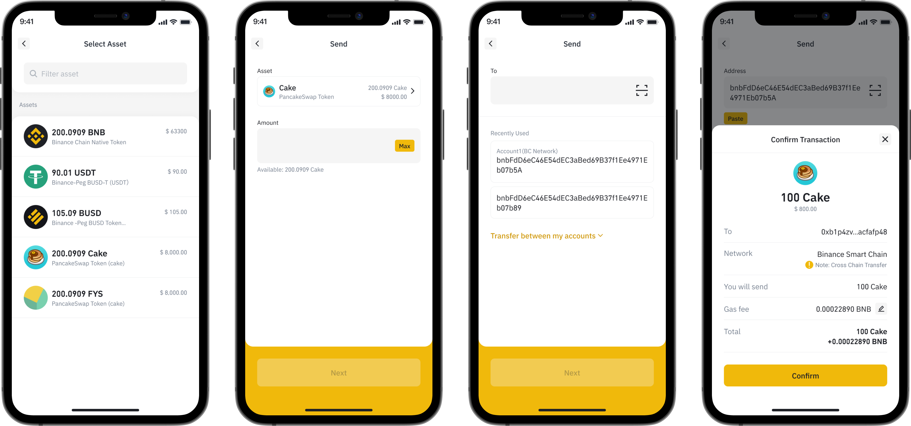
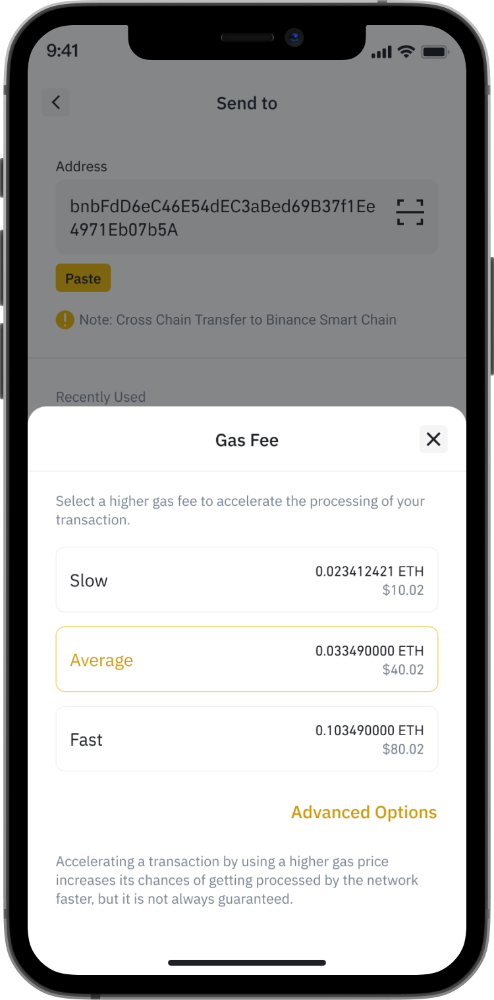

# How to send tokens on BMW

* Step 1: Choose the token you want to send on the home screen.
* Step 2: Click Send.
* Step 3: Insert the amount
* Step 4: Choose the recipient’s wallet address.
* Click Confirm to complete**.**

You can adjust the gas fee, which affects the transaction speed, according to your needs.

