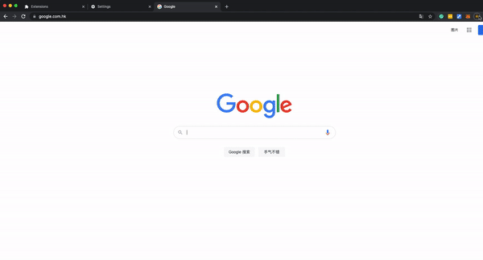

# Connection Issue with Ledger

The latest Google Chrome release \([Chrome 91](https://chromium.googlesource.com/chromium/src/+log/90.0.4430.212..91.0.4472.77?pretty=fuller&n=10000)\)  causes U2F transport issues on third-party wallets like MetaMask for Mac and Linux users. Due to this issue, you might experience issues when trying to connect to BEW wallet. 

This issue also affects other Chromium browsers \(Brave, Microsoft Edge, etc…\) on the same version. 

Considering those changes significantly altering the user experience and the availability of WebUSB as the standard method for interacting with a USB device, we plan to sunset the U2F transport and migrate to WebUSB to natively communicate with Ledger devices. However, we will preserve old logic for Firefox. 

### Before you start

* Make sure you are using the latest version of BEW \(v2.4.0\). 

## Fix connection issues of Chrome

### Pair Binance Chain extension wallet with your Ledger hardware wallet

Chrome lets you connect a website to your Bluetooth and USB devices. 

1. Connect your Ledger.
   * Connect your Ledger Nano s/X using a USB cable.
2. In Chrome, open BEW
3. Click to import wallet from hardware.
4. Choose a device from the list.
5. Choose **Connect**.

Well done! Now you can use Ledger on Chrom again 🎉


If the approval page is not open automatically, you can open it manually with this link:  chrome-extension://fhbohimaelbohpjbbldcngcnapndodjp/popup.html\#/en/hardware-wallet/authority


## Remove Ledger devices connected with Chrome

To remove a website's access to your USB devices, follow these steps:

**First, go to** chrome://settings/content/usbDevices?search=device 

Next to the Ledger device, click Remove .

